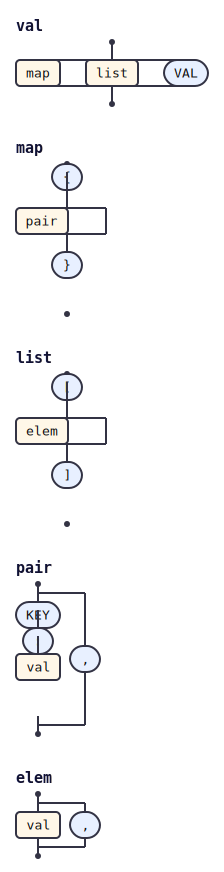

# @tabnas/railroad

Railroad (syntax) diagram renderer for the [`tabnas`](https://github.com/rjrodger/tabnas) parser.

Point it at a tabnas instance that already has a grammar installed and it
introspects the rules and emits three artifacts:

- a declarative **JSON** model of the grammar (the interchange format),
- a vertical-flow **SVG** (one linked, anchored track per rule),
- a vertical **ASCII** diagram.

Diagrams bias toward **verticality** (tall and narrow) so they read well on
laptop browsers and phones: sequences run top-to-bottom, choices fan out
sideways, and optional / repetition rails run on the side.

## Install

```bash
npm install @tabnas/parser @tabnas/railroad
```

## Use as a plugin

Load a grammar plugin (here `@tabnas/json`) and `railroad`, then read the
grammar back out and render it:

```js
const { Tabnas } = require('@tabnas/parser')
const { json } = require('@tabnas/json')
const { railroad } = require('@tabnas/railroad')

const tn = new Tabnas({ plugins: [json, railroad] })
const model = tn.railroad.toJson()

model.start                              // => 'val'
Object.keys(model.rules).length          // => 5
tn.railroad.toSvg().startsWith('<svg')   // => true
```

- `tn.railroad()` / `tn.railroad.toJson()` — the `GrammarModel` for this instance.
- `tn.railroad.toSvg(opts?)` — whole-grammar SVG.
- `tn.railroad.toAscii(opts?)` — whole-grammar ASCII (`{ ascii: true }` for plain `| - +`).

## Sample output

`@tabnas/json` rendered to a vertical-flow diagram
(`tabnas-railroad --grammar @tabnas/json -o examples`):



The same grammar as an ASCII diagram (excerpt — `val`, `map`, `pair`; full
output in [`../examples/json-grammar.txt`](../examples/json-grammar.txt)):

```text
val:
              │
   ┌──────────┼──────────┐
┌──┴──┐   ┌───┴──┐   ╭───┴───╮
│ map │   │ list │   │ "VAL" │
└──┬──┘   └───┬──┘   ╰───┬───╯
   └──────────┼──────────┘
              │

map:
        │
     ╭──┴──╮
     │ "{" │
     ╰──┬──╯
        │
    ┌───┴──┐
┌───┴──┐   │
│ pair │   │
└───┬──┘   │
    └───┬──┘
        │
     ╭──┴──╮
     │ "}" │
     ╰──┬──╯
        │

pair:
    │
    ├────┐
╭───┴───╮│
│ "KEY" ││
╰───┬───╯│
    │    │
 ╭──┴──╮ │
 │ ":" │ │,
 ╰──┬──╯ │
    │    │
 ┌──┴──┐ │
 │ val │ │
 └──┬──┘ │
    ├────┘
    │
```

## The JSON model

```
{ start: string, rules: { [name]: Node }, meta: { engine: 'tabnas' } }
```

`Node` is a small tagged union — `terminal` / `nonterminal` / `comment` /
`skip` / `seq` / `choice` / `optional` / `oneOrMore` / `zeroOrMore`. It is pure
data, so the SVG and ASCII are fully reproducible from the JSON alone. The
constructors and a text form are exported for direct use:

```js
const { toText, Sequence, Choice, Optional } = require('@tabnas/railroad')

toText(Sequence('GET', Optional('path')))   // => '"GET" ["path"]'
toText(Choice('hi', 'hello'))               // => '("hi" | "hello")'
```

## CLI

```bash
# introspect a grammar plugin and write json + svg + ascii into ./diagrams
tabnas-railroad --grammar @tabnas/json -o diagrams

# render a saved model
tabnas-railroad -f diagrams/grammar.railroad.json --ascii
```

## Scope

This renderer introspects **`@tabnas/parser`** (`Tabnas`) instances. The
`@tabnas/ini` and `@tabnas/yaml` grammars target the older `@tabnas/jsonic`
engine and are **not yet supported** (a jsonic introspection adapter is
deferred).

## License

MIT.
